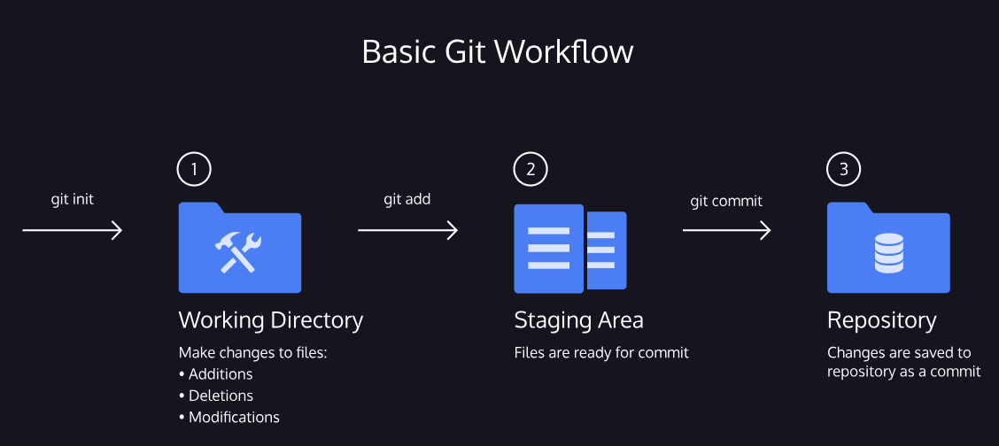
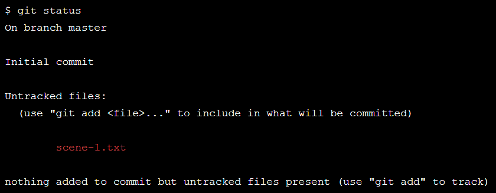
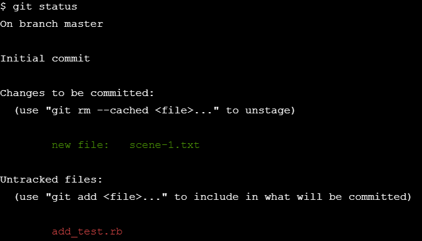
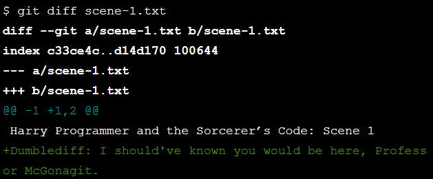

# Basic commands for github
* git --version
* git config --global user.name "w3schools-test"
* git config --global user.email "test@w3schools.com"
* git config --list
* mkdir newdir
* cd newdir
* git init => initializes the repo with git
* touch scene-1.txt
## Git workflow

A Git project can be thought of as having three parts:

1) A Working Directory: where you’ll be doing all the work: creating, editing, deleting and organizing files
2) A Staging Area: where you’ll list changes you make to the working directory
3) A Repository: where Git permanently stores those changes as different versions of the project

The Git workflow consists of editing files in the working directory, adding files to the staging area, and saving changes to a Git repository. 

### Basic commands
* git status

* git add filename => In order for Git to start tracking scene-1.txt, the file needs to be added to the staging area.  **git add scene-1.txt** 
* edit scene-1.txt
* git diff scene-1.txt 

&ensp;&ensp;&ensp;&ensp;&ensp;&ensp;
* git commit

&ensp;&ensp;&ensp;&ensp; A commit is the last step in our Git workflow. A commit permanently stores changes from the staging area inside the repository.

&ensp;&ensp;&ensp;&ensp;**git commit -m "Complete first line of dialogue"**
* git log

&ensp;&ensp;&ensp;&ensp;
With Git, you’ll need to refer back to an earlier version of a project. 

&ensp;&ensp;&ensp;&ensp;
Commits are stored chronologically in the repository and can be viewed with: **git log**

git cheet sheet :  https://education.github.com/git-cheat-sheet-education.pdf

## Git Backtracking

