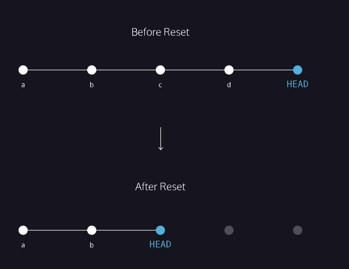

# Basic commands for github
* git --version
* git config --global user.name "w3schools-test"
* git config --global user.email "test@w3schools.com"
* git config --list
* mkdir newdir
* cd newdir
* git init => initializes the repo with git
* touch scene-1.txt
## Git workflow

A Git project can be thought of as having three parts:

1) A Working Directory: where you’ll be doing all the work: creating, editing, deleting and organizing files
2) A Staging Area: where you’ll list changes you make to the working directory
3) A Repository: where Git permanently stores those changes as different versions of the project

The Git workflow consists of editing files in the working directory, adding files to the staging area, and saving changes to a Git repository. 

### Basic commands
* git status

* git add filename => In order for Git to start tracking scene-1.txt, the file needs to be added to the staging area.  **git add scene-1.txt** 
* edit scene-1.txt
* git diff scene-1.txt 

&ensp;&ensp;&ensp;&ensp;&ensp;&ensp;
* git commit

&ensp;&ensp;&ensp;&ensp; A commit is the last step in our Git workflow. A commit permanently stores changes from the staging area inside the repository.

&ensp;&ensp;&ensp;&ensp;**git commit -m "Complete first line of dialogue"**
* git log

&ensp;&ensp;&ensp;&ensp;
With Git, you’ll need to refer back to an earlier version of a project. 

&ensp;&ensp;&ensp;&ensp;
Commits are stored chronologically in the repository and can be viewed with: **git log**

git cheet sheet :  https://education.github.com/git-cheat-sheet-education.pdf

## Git Backtracking

>#### head commit
> In Git, the commit you are currently on is known as the HEAD commit.\
> **git show HEAD**

>#### git checkout
> If you make changes to scene_5.txt, later you want to discard it you can do it with checkout.\
> **git checkout HEAD scene_5.txt**

>#### git add
> git add *  => adds all the files for staging.\
> git add fil1.html file5.html => adds selected file for commiting

>#### git reset
> Edit file2.html\
> Add file2.html for staging => git add file2.html \
> To unstage a file from staging can be done using the following command\
> **git reset HEAD file2.html**

>#### git reset commit
> Just like retracing your steps on that hike, Git enables you to rewind to the part before you made the wrong turn. You can do this with:**git reset commit_SHA**\
> This command works by using the first 7 characters of the SHA of a previous commit.
>\
>Before reset:
>- HEAD is at the most recent commit

>After resetting:
>- HEAD goes to a previously made commit of your choice
>- The gray commits are no longer part of your project
>- You have in essence rewound the project’s history

