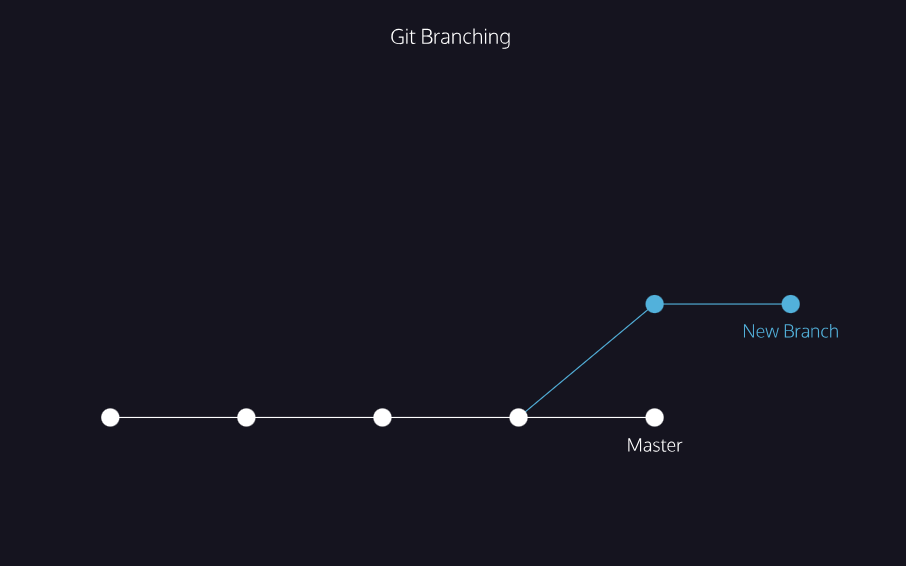

# Git Branch
Create a branch for every task or issue you work on. This ensures that your work on the task or issue is isolated from your existing codebase. That makes it easier to work on multiple parts of the project simultaneously, or try out ideas without adversely affecting your main codebase.\
By defaualt you will be in main branch. The following command will help you to see which branch you are on
* git branch
* 
* The circles are commits, and together form the Git project’s commit history.
* New Branch is a different version of the Git project. It contains commits from the main branch but also has commits that it does not have.

